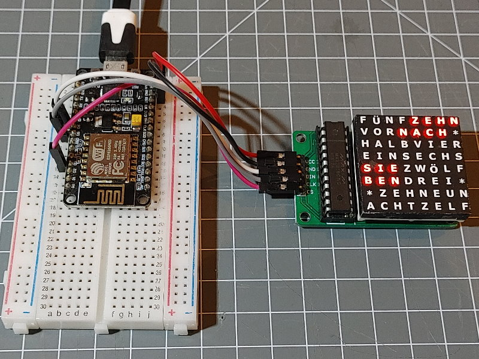
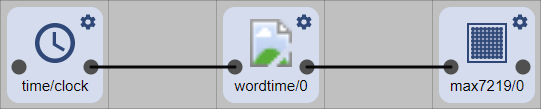

# The WordClock Example

This folder contains an example for a wordclock implementations (Germany layout). It also illustrates how to implement something special
using the HomeDing Library and selected standard Elements but to add a new functionality.



The challenge shown in this example is to implement the pattern generator for the wordclock on a 8*8 matrix.
This is a very specific piece of source code exactly for this specific IoT Device. But instead of building everything
yourself by using various libraries the ecosystem of the HomeDing is also a good starting point.


## Base Sketch 

The sketch file (WordClock.ino) is a copy of the Standard example but some elements are not included to keep the resulting firmware small.

This sketch creates the runtime environment and includes the helpful elements.
The Arduino typical setup() and loop() approach can also be used but is better contained in a separate file.


## Project specific code 

Beside the functionality in the base sketch a new Element is implemented in the WordClock.cpp file
that includes the specific code for this device. This element class is then plugged into the ecosystem of actions.



* Instead of implementing functionality of the typical **setup()** function
  all the code should be placed into the **start()** function.

* Instead of implementing functionality of the typical **loop()** function
  all the code can be placed into the **loop()** function.

* If you like to participate in using configuration parameters you can place a specific code in the **set()** function to get a configuration.

* Incoming actions can also be implemented in the **set()** function.

In this example a **WordClock** element is implemented that receives the current time and creates a pattern for the LED matrix.
To send the bitmap away a action will be triggered when the time has changed.  


## Wiring

The 8*8 matrix needs to be connected to the EPS8266 board using the SPI bus:

| pin        | function       | max7219        |
| ---------- | -------------- | -------------- |
| GPIO14(D5) | SPI-CLK        | Clock          |
| GPIO13(D7) | SPI-MOSI       | Data to Matrix |
| GPIO0(D3)  | CS for max7219 | Matrix Select  |
| VCC        | +5V            | VCC from USB   |
| GND        | GND            | Common Ground  |

While GPIO14(D5) and GPIO13(D7) must be used because they correspond to the SPI bus implementation by hardware
the GPIO0(D3) can be exchanged. It is configured in the config.json file.


## Env.json

This is a system configuration file for this example:

```JSON
{
  "device": {
    "0": {
      "name": "wordclock",
      "description": "Word Clock",
      "loglevel": 1,
      "logfile": 1,
      "button": "D3",
      "led": "D4",
      "safemode": "false"
    }
  },
  "ota": {
    "0": {}
  },
  "ntptime": {
    "on": {
      "zone": "CET-1CEST,M3.5.0,M10.5.0/3"
    }
  }
}
```

This configures for German timezone and unsafe mode. Please see documentation on how to change.


## Config.json

This is a configuration file for this example:

```JSON
{
  "time": {
    "clock": {
      "onminute": "wordtime/0?value=$v"
    }
  },
  "wordtime": {
    "0": {
      "onvalue": "max7219/0?value=$v"
    }
  },
  "max7219": {
    "0": {
      "loglevel": 2,
      "cspin": "D3",
      "brightness": 2,
      "mode": "8x8"
    }
  }
}
```
